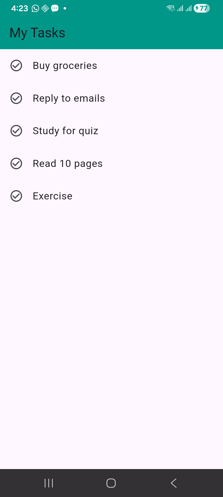
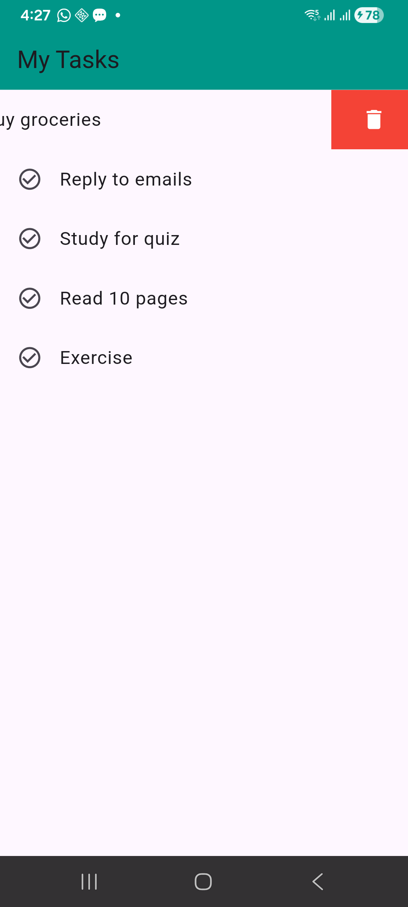
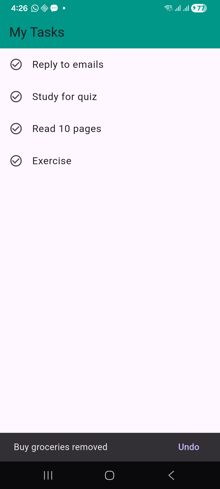
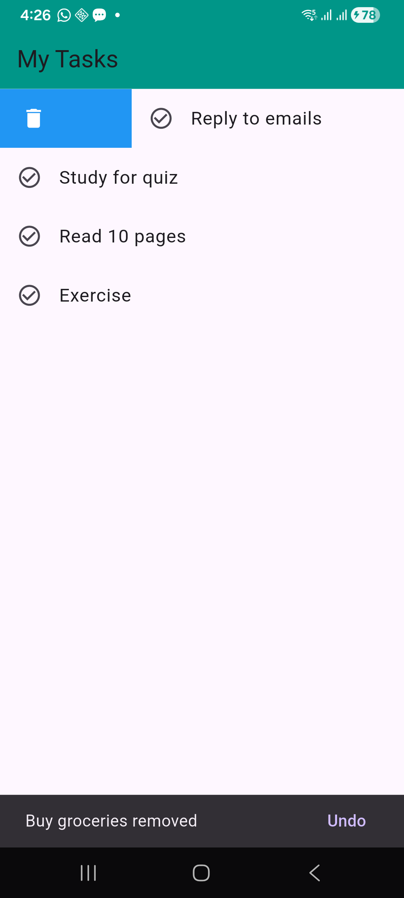

# Dismissible Widget Demo

A simple Flutter application demonstrating the Dismissible widget for removing items by swiping them off the screen using a real-world Todo list scenario.

## Real-World Use Case

The **Dismissible** widget is commonly used in:

- Email apps (e.g., Gmail for archiving emails)

- Todo apps (remove tasks)

- Messaging apps (e.g., Telegram for archiving conversations)

This demo shows how users can swipe horizontally to remove tasks, with an option to undo the action.

## How to Run

Make sure Flutter is installed on your device.

Clone the repository:

`git clone <https://github.com/mahlet-tilahun/dismissable_widget_demo.git>`

Navigate into the project folder:

`cd dismissible_widget_demo`

Run the app:

`flutter run`

## Project Structure

A minimal overview of the main directories and files:

- `lib/` – Contains Dart source code; `main.dart` is the entry point.
- `android/`, `ios/`, `web/`, `linux/`, `macos/`, `windows/` – Platform-specific folders generated by Flutter.
- `pubspec.yaml` – Defines dependencies and assets.
- `README.md` – This documentation file.
- `screenshots/` – Contains the screenshots used in this README.

```
dismissable_widget_demo/
├── lib/
│   └── main.dart
├── test/
│   └── widget_test.dart
├── android/
├── ios/
├── web/
├── linux/
├── macos/
├── windows/
├── screenshots/
│   └── (image files)
├── pubspec.yaml
└── README.md
```

## Three Demonstrated Dismissible Properties

### key

`key: Key(task),`

- Identifies each list item uniquely.

- Required so Flutter can track which widget is removed.

- Without a key the Dismissible widget will throw an error.

- Used when working with dynamic lists to avoid UI update bugs.

### direction

`direction: DismissDirection.horizontal,`

- Controls swipe direction.

- By default allows both directions.

- In the code it is set to horizontal allowing users to swipe in both directions.

- It can be used to restrict swiping directions based on app design.

### background

```
background: Container(
  color: Colors.blue,
  alignment: Alignment.centerRight,
  padding: EdgeInsets.only(right: 20),
  child: Icon(Icons.delete),
),
```

- Appears behind the item when swiping.

- Provides visual feedback.

- Shows delete icon.

- Improves user experience by clearly indicating the action being performed.

## Additional Functionality

- The `onDismissed` callback removes the task from the list and shows a SnackBar with an Undo option.

- The `secondaryBackground` sets different properties like color for when the widget is swiped in a different direction.

## Screenshots

## Screenshots

<table>
  <tr>
    <td align="center">
      <br>
      Initial Task List View
    </td>
    <td align="center">
      <br>
      Swiping left to Delete
    </td>
  </tr>
  <tr>
    <td align="center">
      <br>
      Undo SnackBar
    </td>
    <td align="center">
      <br>
      Swiping right shows secondary color
    </td>
  </tr>
</table>
